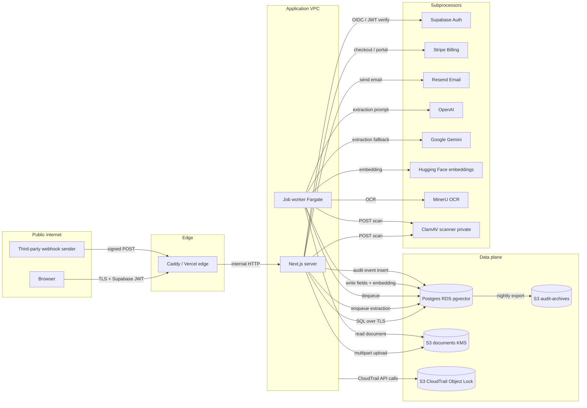

# DocuBite data-flow diagram

Closes ID.AM-03. Every trust boundary crossed by customer data is drawn explicitly so the
STRIDE analysis in [../security/threat-model.md](../security/threat-model.md) can attach threats
to the boundary they apply to.

## Trust boundaries

- **Public internet** — everything a browser or third-party webhook sender can reach.
- **Edge** — Caddy (Lightsail) / Vercel edge / CloudFront (planned) — terminates TLS and enforces
  the app-layer CSP and security headers configured in `next.config.ts` and `proxy.ts`.
- **Application VPC** — Next.js web server and job worker; only reachable through the edge or
  through internal VPC endpoints. Peers with RDS and MinerU via private networking.
- **Data plane** — Postgres (RDS pgvector), S3 documents bucket, S3 audit-archives, S3
  CloudTrail bucket. KMS-backed encryption at rest. No public ingress.
- **Subprocessors** — OpenAI, Google Gemini, Hugging Face, MinerU, Supabase Auth, Stripe,
  Resend, Cloudflare. Each is a separate trust boundary with its own DPA (see
  [../security/registers/supplier-register.csv](../security/registers/supplier-register.csv)).

## End-to-end request

## Data classes on each edge

| Edge | Data in flight | Classification | Encryption |
|---|---|---|---|
| Browser → Edge | Session cookie, upload bytes, form values | Restricted | TLS 1.2+ |
| Edge → App | Same (behind the reverse proxy) | Restricted | Internal TLS or mTLS |
| App → RDS | Structured document rows, users, audit events | Restricted | TLS + SSE |
| App → S3 documents | Full document bytes | Restricted | TLS + SSE-KMS |
| App → Scanner | Full document bytes | Restricted | TLS |
| Worker → MinerU | Document bytes | Restricted | TLS |
| Worker → OpenAI/Gemini | Extracted text fragments | Restricted | TLS |
| Worker → HF | Extracted text (for embedding) | Confidential | TLS |
| App → Stripe | Customer name, email, card token | Restricted (card via Stripe Elements only) | TLS |
| App → Resend | Recipient email, transactional body | Confidential | TLS |
| App → Supabase | Session state, MFA challenge | Restricted | TLS |
| RDS → S3 audit-archives | Audit event rows (nightly) | Confidential | TLS + SSE-KMS |
| App → CloudTrail | API metadata (via AWS SDK) | Confidential | TLS + SSE-KMS + Object Lock |

## Framework mapping

- ID.AM-03 (organisational communications and data flows mapped) — this document.
- ID.AM-04 (external systems catalogued) — Subs boundary above, plus
  [../security/registers/supplier-register.csv](../security/registers/supplier-register.csv).
- ID.AM-07 / ID.AM-08 (data at rest / in transit classification) — the tables above.
